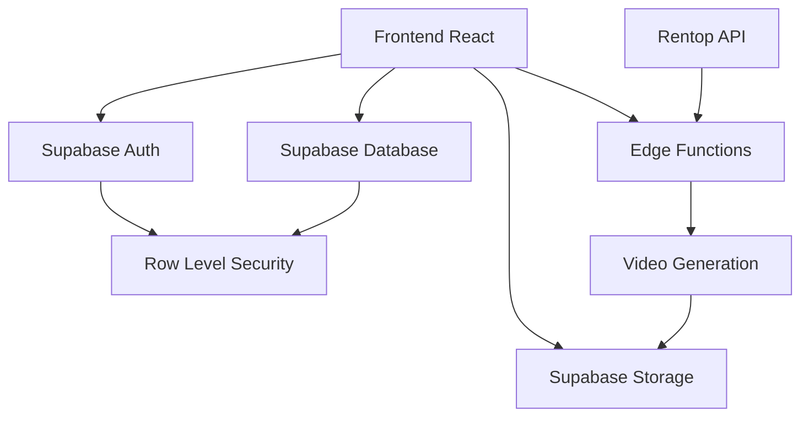

# Architecture Générale

## Vue d'ensemble de l'Architecture



## Couches de l'Application

### 1. Couche Présentation (Frontend)
- **Framework** : React 18 avec TypeScript
- **Styling** : Tailwind CSS + Shadcn/ui
- **State Management** : React Query + useState/useContext
- **Routing** : React Router DOM

### 2. Couche Authentification
- **Provider** : Supabase Auth
- **Méthode** : Email/Password uniquement
- **Restriction** : Liste blanche d'emails autorisés
- **Sécurité** : RLS (Row Level Security) au niveau base de données

### 3. Couche Données
- **Database** : PostgreSQL via Supabase
- **ORM** : Supabase Client SDK
- **Cache** : React Query pour le cache côté client
- **Storage** : Supabase Storage pour les fichiers vidéo

### 4. Couche Métier (Edge Functions)
- **Runtime** : Deno
- **API External** : Intégration avec Rentop API
- **Processing** : Génération et traitement vidéo
- **Validation** : Contrôle d'accès et validation des données

## Flux de Données Principal

### 1. Authentification
```
User Login → Supabase Auth → Email Validation → User Session → App Access
```

### 2. Génération de Vidéo
```
URL Input → Rentop Scraping → Data Processing → Video Generation → Storage → Database Record
```

### 3. Affichage des Vidéos
```
User Request → Database Query (RLS) → Video List → Preview/Download
```

## Patterns Architecturaux Utilisés

### 1. Component-Based Architecture
- Composants réutilisables et modulaires
- Séparation des responsabilités
- Props typing avec TypeScript

### 2. Hook-Based State Management
- Custom hooks pour la logique métier
- Séparation entre UI et logique
- Réutilisabilité du code

### 3. Server-First Security
- Authentification côté serveur
- Row Level Security (RLS)
- Validation des données en Edge Functions

### 4. Reactive Data Flow
- React Query pour la synchronisation
- Real-time updates via Supabase
- Optimistic updates

## Sécurité par Design

### 1. Authentication-First
- Aucun accès sans authentification
- Liste blanche stricte des utilisateurs
- Session management automatique

### 2. Database-Level Security
- RLS policies sur toutes les tables
- User-scoped data access
- Automated data validation

### 3. API Security
- Edge Functions avec validation
- CORS configuration appropriée
- Error handling sécurisé

## Performance & Scalabilité

### 1. Frontend Optimization
- Lazy loading des composants
- React Query caching
- Optimized bundle avec Vite

### 2. Database Optimization
- Indexes appropriés
- Efficient queries
- Connection pooling via Supabase

### 3. Storage Optimization
- CDN delivery via Supabase
- Optimized video formats
- Automatic compression